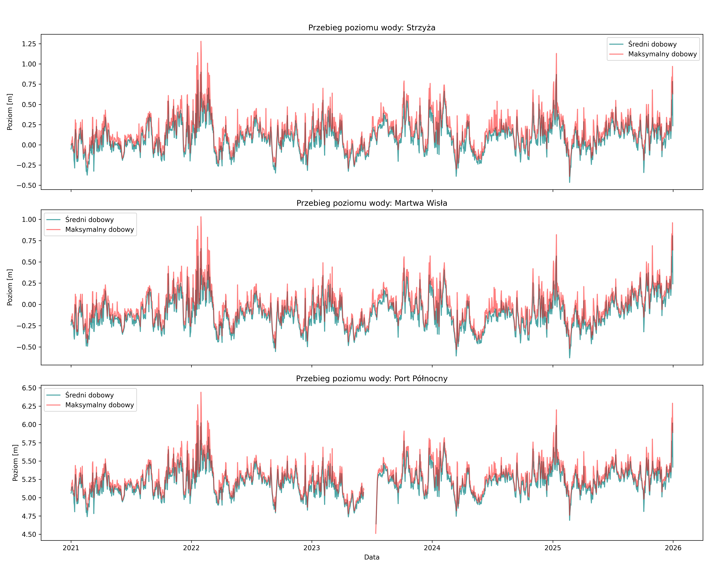
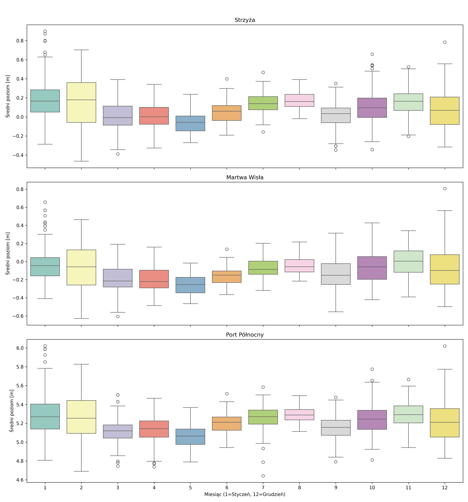
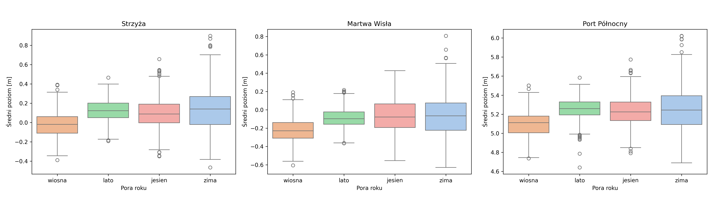
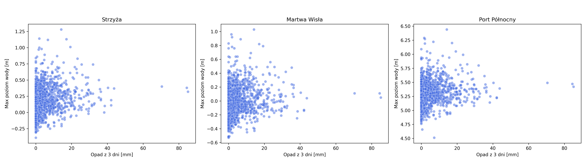
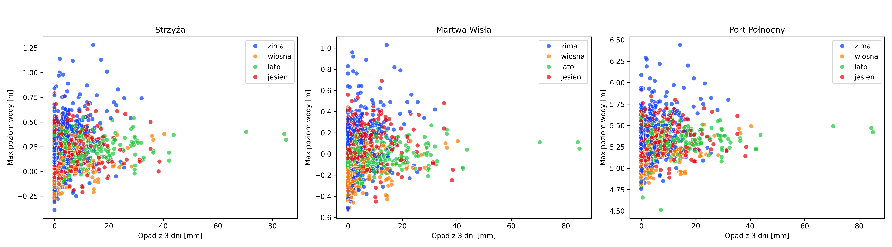
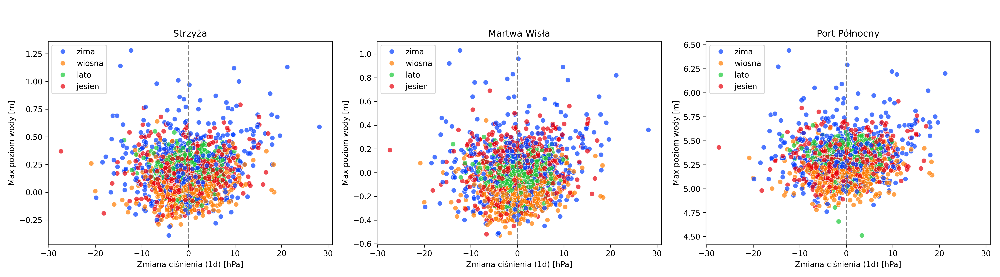
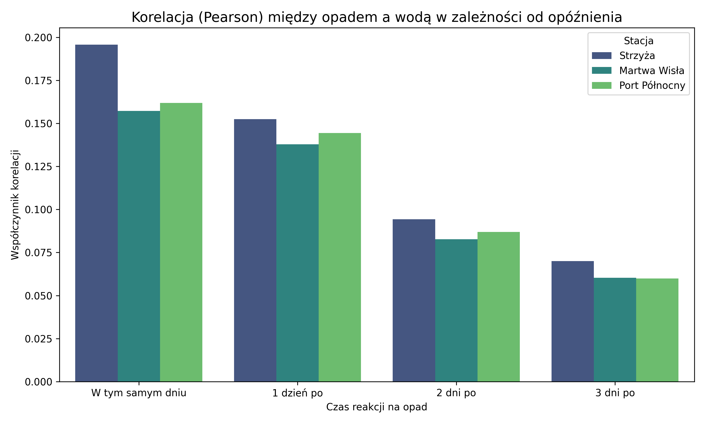
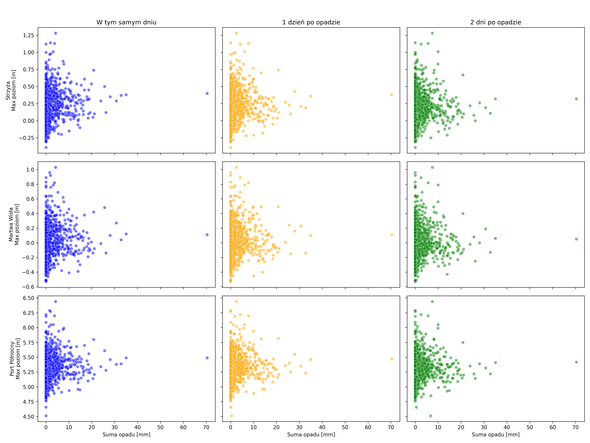

## Rozdział: Wyniki analizy eksploracyjnej

### 4.1. Sezonowość poziomu wody w układzie Zatoka-Rzeka (2021-2025)

**Przebieg długoterminowy i synchronizacja zjawisk**

Analiza szeregów czasowych z lat 2021–2025 dla trzech punktów pomiarowych (Strzyża, Martwa Wisła, Port Północny) ujawnia niemal perfekcyjną synchronizację wahań poziomu wody. Wykresy przebiegu dobowego pokazują, że najwyższe piki wezbraniowe (np. początek 2022 i koniec 2025 roku) oraz najgłębsze spadki występują na wszystkich trzech stacjach dokładnie w tym samym czasie. 

Taka charakterystyka dowodzi, że cały badany węzeł wodny funkcjonuje jak system naczyń połączonych, w którym głównym dyktatorem warunków hydrologicznych jest Zatoka Gdańska (reprezentowana przez Port Północny), a wpływ lokalnych zjawisk wewnątrz zlewni (własny nurt Strzyży) schodzi na dalszy plan w obliczu dominujących wezbrań morskich.

**Zmienność miesięczna i sezonowa**

Analiza rozkładów wartości (wykresy pudełkowe) wskazuje na spójną sezonowość dla całego układu, niezależnie od odległości od otwartego morza:

* **Miesiące niżówkowe (Wiosna):** Zdecydowanie najniższe stany wód notowane są w sezonie wiosennym, z wyraźnym minimum przypadającym na **maj**. Mediany dla tego miesiąca są najniższe na wszystkich trzech stacjach. Wynika to z uspokojenia cyrkulacji atmosferycznej nad Bałtykiem po okresie zimowym oraz braku głębokich niżów pompujących wodę do zatoki.
* **Miesiące o najwyższym stanie i największej dynamice (Zima):** Najwyższe średnie poziomy wody charakteryzują porę zimową (**styczeń i luty**). Zima jest również okresem o największej wariancji (najdłuższe wąsy na wykresach pudełkowych) oraz największej liczbie wartości odstających "w górę" na każdej ze stacji. Potwierdza to ścisły związek ekstremalnych wezbrań z zimowym sezonem sztormowym na Bałtyku i zjawiskiem cofki wiatrowej.
* **Letnie i jesienne odpływy wiatrowe:** Bardzo ciekawym zjawiskiem, widocznym szczególnie wyraźnie na stacji Port Północny w lipcu, jest obecność skrajnych wartości odstających "w dół" (spadki poziomu wody poniżej 4,7 m). Są to klasyczne zjawiska odpływów wiatrowych, występujące, gdy silne i długotrwałe wiatry z południa i wschodu odpychają masy wody z Zatoki Gdańskiej na otwarte morze, co błyskawicznie "odsysa" wodę również z Martwej Wisły i koryta Strzyży.

---

### 4.2. Zależności poziom wody – warunki meteorologiczne

**Wpływ opadów skumulowanych (72h)**

Analiza wykresów rozrzutu (zależność maksymalnego poziomu wody od sumy opadów z 3 poprzedzających dni) dla wszystkich trzech stacji pomiarowych dostarcza jednoznacznych wniosków na temat roli opadów w badanym węźle wodnym:

* **Brak korelacji dla ekstremów:** We wszystkich trzech punktach układu (Strzyża, Martwa Wisła, Port Północny) absolutnie najwyższe stany wód występują niemal wyłącznie w dniach o znikomym lub zerowym opadzie skumulowanym (głównie w porze zimowej – punkty niebieskie). Oznacza to, że opad atmosferyczny nie jest bezpośrednim czynnikiem wyzwalającym stany alarmowe w tym regionie.
* **Marginalny wpływ letnich ulew:** Bardzo wysokie sumy opadów (przekraczające 60–80 mm w ciągu 72 godzin) notowane są wyłącznie latem (zielone punkty). Choć wywołują one zauważalne, krótkotrwałe wezbrania na rzece Strzyża, ich wpływ na Martwą Wisłę i Port Północny jest praktycznie niezauważalny. Zdolność retencyjna i objętość akwenów morskich całkowicie buforują te opady, co potwierdza, że zagrożenie powodziowe latem ma tu charakter wyłącznie lokalny (tzw. powodzie błyskawiczne w uszczelnionej zlewni Strzyży), a nie systemowy.

**Wpływ dynamiki ciśnienia atmosferycznego (proxy wiatru i sztormów)**

Wykresy zależności poziomu wody od dobowej zmiany ciśnienia atmosferycznego (wskaźnik `Ciśnienie_delta_1d` użyty jako proxy dla przechodzących frontów i siły wiatru) bezsprzecznie tłumaczą genezę ekstremów hydrologicznych w całym systemie:

* **"Lejek" zmienności układu:** Wszystkie trzy stacje wykazują identyczny, charakterystyczny kształt lejka. W dniach o stabilnej sytuacji barycznej (zmiana ciśnienia bliska 0 hPa) poziom wody jest przewidywalny i skupiony w wąskim przedziale bliskim średniej. Jednak wraz ze wzrostem dynamiki ciśnienia – co oznacza nadciągające głębokie niże lub silne wyże – rozrzut i wariancja poziomu wody drastycznie rosną na każdej ze stacji.
* **Dominacja zjawisk morskich (cofki i odpływy):** Historyczne maksima (sztormowe wezbrania zimowe) oraz skrajne minima (odpływy wiatrowe) występują przy wahaniach ciśnienia przekraczających 10–20 hPa/dobę. Fakt, że zależność ta jest tak samo silna dla otwartego Portu Północnego, jak i ujściowego odcinka rzeki Strzyży, stanowi twardy dowód na to, że ekstremalne zjawiska hydrologiczne w Gdańsku są napędzane mechanicznie od strony morza. To silne wiatry i zmiana ciśnienia na Bałtyku "wtłaczają" lub "wypychają" wodę z systemu, czyniąc parametry cyrkulacyjne kluczowymi predyktorami dla przyszłych modeli predykcyjnych.

---

### 4.3. Analiza czasowa reakcji na opad (opóźnienia / lags)

**Dynamika spływu i czas reakcji w układzie rzeka-morze**

Analiza współczynników korelacji Pearsona pomiędzy sumą opadów a maksymalnym dobowym poziomem wody dla różnych opóźnień czasowych ujawnia spójną dynamikę dla całego badanego układu hydrologicznego:

* **Natychmiastowa reakcja systemu:** Dla wszystkich trzech stacji pomiarowych najwyższą wartość korelacji zaobserwowano dla opadu występującego **w tym samym dniu** (brak opóźnienia). Z każdym kolejnym dniem siła związku maleje. Dowodzi to bardzo krótkiego czasu koncentracji odpływu. W przypadku Strzyży wynika to z silnego zurbanizowania i uszczelnienia zlewni (woda z ulic błyskawicznie trafia do koryta). Z kolei jednodniowa reakcja w Porcie Północnym i na Martwej Wiśle sugeruje, że opad jest tam jedynie zjawiskiem współwystępującym z przechodzącymi, szybkimi frontami atmosferycznymi.
* **Gradient wpływu opadów:** Wykres słupkowy wyraźnie uwidacznia przestrzenny spadek znaczenia opadów. Najwyższą korelację z deszczem wykazuje rzeka Strzyża (ok. 0.19), nieco niższą Martwa Wisła (ok. 0.16), a najniższą Port Północny (ok. 0.15). Jest to logiczne z punktu widzenia fizjografii terenu – im bliżej otwartego morza, tym wpływ lokalnych ulew na poziom lustra wody jest mocniej "rozmywany" przez ogromną objętość akwenu.

**Ostateczna weryfikacja dominującego czynnika wezbrań**

Panel wykresów punktowych (scatter plots) zestawiający sumę opadów z poziomem wody w poszczególnych dniach opóźnienia stanowi ostateczne potwierdzenie unikalnego charakteru gdańskiego węzła wodnego:

* Niezależnie od analizowanej stacji (Strzyża, Martwa Wisła, Port Północny) oraz badanego opóźnienia, absolutnie najwyższe stany wód (górne partie osi Y) konsekwentnie grupują się po lewej stronie wykresów – przy wartościach opadu bliskich zera (0-10 mm).
* Duże sumy opadów (powyżej 30-40 mm) generują jedynie umiarkowane wzrosty poziomu wody, bezpiecznie mieszczące się w korytach i basenach portowych.

Powyższe obserwacje bezsprzecznie dowodzą, że opady atmosferyczne nie stanowią w tym rejonie głównego zagrożenia powodziowego. Cały badany system – od otwartego Portu Północnego, przez Martwą Wisłę, aż po ujściowy odcinek Strzyży – jest w pełni zdominowany przez reżim morski. Ekstremalne wezbrania są tu wywoływane mechanicznie przez zjawisko tzw. "cofki" wiatrowej z Zatoki Gdańskiej, co czyni czynniki cyrkulacyjne (wiatr, ciśnienie) najważniejszymi predyktorami w docelowym modelu uczenia maszynowego.