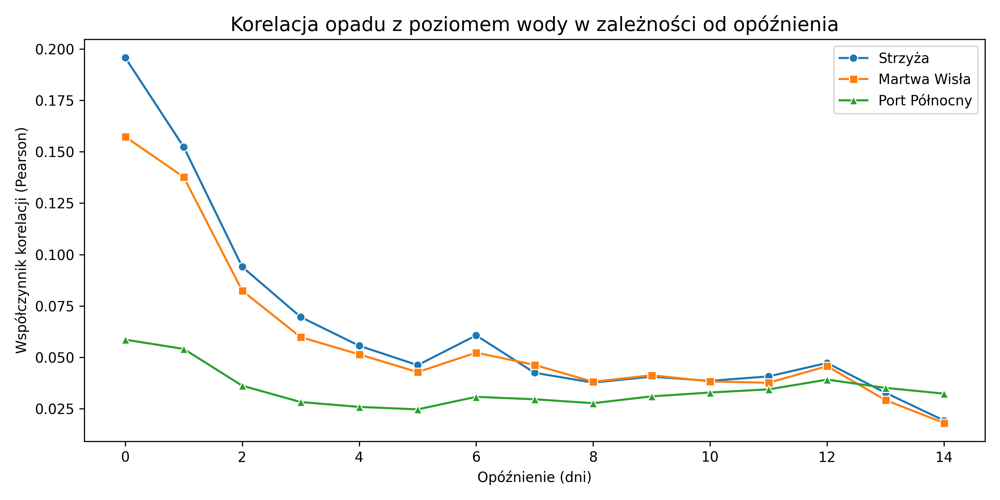
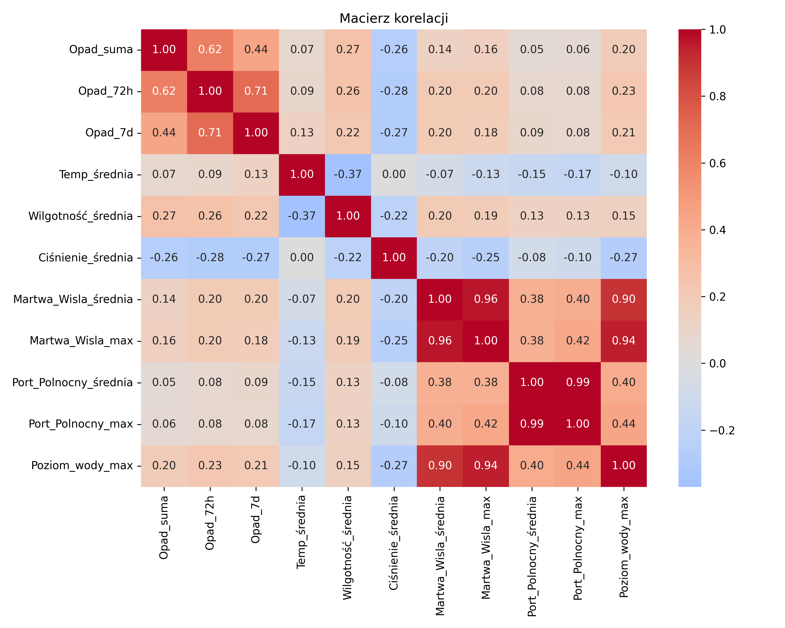
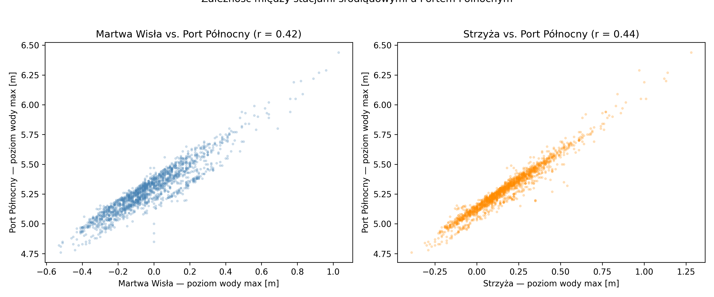
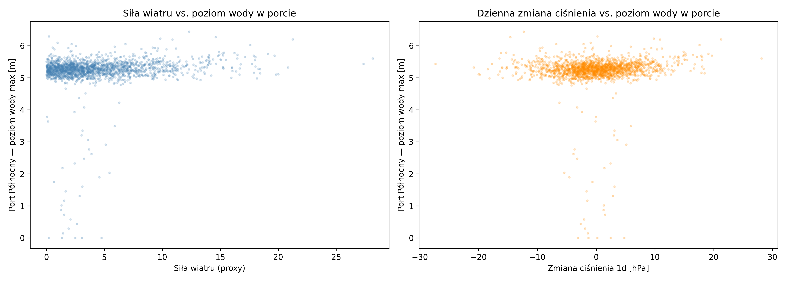
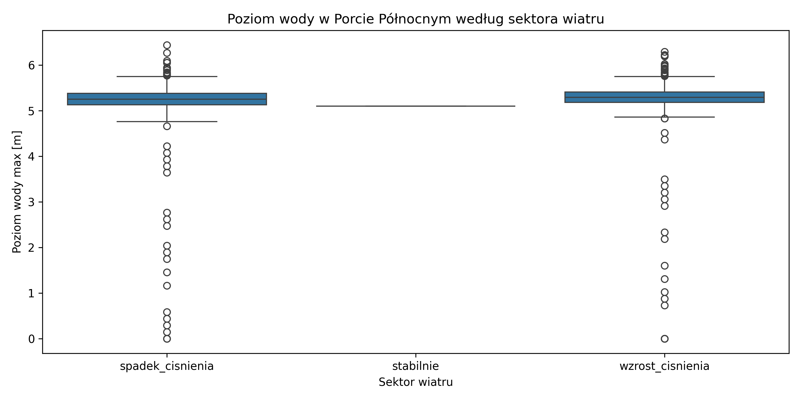
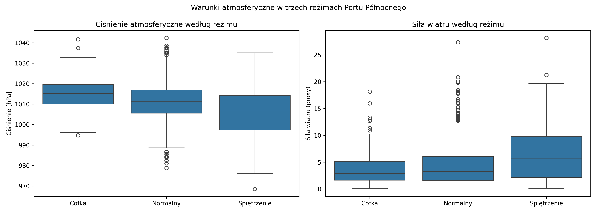

# Analiza statystyczna zależności między opadem atmosferycznym a poziomem wody

---

## 1. Metodyka

Analizę przeprowadzono dla trzech stacji pomiarowych poziomu wody: **Strzyża**, **Martwa Wisła** i **Port Północny**. Zastosowane metody:

1. **Analiza korelacji krzyżowej z opóźnieniem** — współczynnik Pearsona między dobową sumą opadu a poziomem wody dla opóźnień 0–14 dni, osobno dla każdej stacji.
2. **Macierz korelacji** — współzależności liniowe między wszystkimi zmiennymi meteorologicznymi i hydrologicznymi.
3. **Korelacja między stacjami** — ocena podobieństwa odpowiedzi hydrologicznej między stacjami.
4. **Korelacja Spearmana** — ocena monotonicznej zależności odpornej na rozkład asymetryczny.
5. **Analiza grupowa** — porównanie rozkładów poziomu wody (KDE, boxplot) w dniach z małym (Q25) i dużym opadem (Q75) oraz test Manna-Whitneya U.
6. **Analiza predyktorów atmosferycznych Portu Północnego** — korelacje ciśnienia i wiatru z poziomem wody, identyfikacja trzech reżimów hydrologicznych.

---

## 2. Wyniki

### 2.1 Korelacja krzyżowa z opóźnieniem (lag 0–14 dni)

| Stacja | Maksymalna korelacja (lag=0) |
|---|---|
| Strzyża | r = 0,196 |
| Martwa Wisła | r = 0,157 |
| Port Północny | r = 0,160 |

Dla wszystkich trzech stacji najwyższa korelacja z opadem występuje przy lag=0 i spada gwałtownie w kolejnych dniach. Dla Strzyży i Martwej Wisły widoczna jest lokalna anomalia w dniu 6 (możliwy opóźniony dopływ z wód gruntowych lub efekt retencyjny). Sygnał zanika dla lag > 7 we wszystkich stacjach.

Zbliżone wartości maksymalnej korelacji wskazują, że wszystkie trzy stacje reagują na opad z podobną siłą i w podobnym horyzoncie czasowym.

---

### 2.2 Macierz korelacji

**Zmienne opadowe** są wzajemnie silnie skorelowane (`Opad_72h` ↔ `Opad_7d`: r = 0,71; `Opad_suma` ↔ `Opad_72h`: r = 0,62), ponieważ są pochodnymi tych samych pomiarów. Przy modelowaniu należy unikać ich jednoczesnego użycia ze względu na multikolinearność.

**Korelacja opad–poziom wody** jest zbliżona dla wszystkich stacji (r ≈ 0,14–0,23), z `Opad_72h` jako najsilniejszym predyktorem liniowym.

**Ciśnienie atmosferyczne** koreluje ujemnie zarówno z opadem (r ≈ –0,27), jak i z poziomem wody na wszystkich stacjach (r ≈ –0,24 do –0,27) — niskie ciśnienie sprzyja opadom i podwyższonemu stanowi wód.

**Temperatura** wykazuje niemal zerową korelację z poziomem wody (r ≈ –0,07 do –0,10), co może sugerować brak wyraźnego efektu roztopowego w skali całego okresu obserwacji.

**Korelacja między stacjami** — wszystkie trzy stacje są silnie wzajemnie skorelowane (r = 0,89–0,97), co wskazuje na spójny system hydrologiczny reagujący na podobne czynniki atmosferyczne.

---

### 2.3 Zależność między stacjami śródlądowymi a Portem Północnym

Wykresy rozrzutu pokazują wyraźnie liniową, wąską chmurę punktów dla obu par (Martwa Wisła ↔ Port Północny oraz Strzyża ↔ Port Północny). Gdy poziom wody na stacjach śródlądowych rośnie, poziom wody w Porcie Północnym rośnie proporcjonalnie — w sposób przewidywalny i spójny. Sugeruje to, że w typowych warunkach stacje śródlądowe mogą stanowić użyteczny sygnał pomocniczy dla Portu Północnego.

---

### 2.4 Korelacja Spearmana

| Stacja | Pearson r | Spearman ρ | Różnica |
|---|---|---|---|
| Strzyża | 0,196 | 0,292 | +0,096 |
| Martwa Wisła | 0,157 | 0,272 | +0,114 |
| Port Północny | 0,160 | 0,256 | +0,096 |

We wszystkich stacjach korelacja Spearmana jest konsekwentnie wyższa od Pearsona, co wskazuje na **monotoniczną, lecz nieliniową zależność** między opadem a poziomem wody. Dominacja dni bez opadu (zero-inflated) tłumi wartość Pearsona — Spearman jest w tym przypadku bardziej adekwatną miarą.

---

### 2.5 Analiza grupowa: mały vs. duży opad

Rozkłady poziomu wody przy dużym opadzie (Q75) są we wszystkich stacjach przesunięte w prawo względem rozkładów przy małym opadzie (Q25). Rozkłady przy dużym opadzie wykazują wyraźniejszą asymetrię prawostronną — długi ogon po prawej stronie sygnalizuje obecność ekstremalnych zdarzeń wezbraniowych, które nie mają odpowiednika przy niskich opadach.

| Stacja | Mały opad (≤ Q25) | Duży opad (≥ Q75) | Różnica |
|---|---|---|---|
| Strzyża | 0,122 m | 0,257 m | +0,135 m |
| Martwa Wisła | –0,070 m | 0,056 m | +0,126 m |
| Port Północny | 5,244 m | 5,362 m | +0,117 m |

#### Test Manna-Whitneya U

| Stacja | p-value | Wniosek |
|---|---|---|
| Strzyża | 4,64 × 10⁻³¹ | Różnica wysoce istotna |
| Martwa Wisła | 1,84 × 10⁻²⁷ | Różnica wysoce istotna |
| Port Północny | 2,63 × 10⁻²⁴ | Różnica wysoce istotna |

Dla wszystkich stacji różnica poziomu wody między grupami jest statystycznie wysoce istotna. Przy dużej liczebności próby test wykrywa nawet małe różnice — istotniejsza jest tu wielkość efektu: różnica wynosi 0,117–0,135 m w zależności od stacji.

---

### 2.6 Port Północny — analiza ciśnienia i wiatru

Ciśnienie atmosferyczne i wiatr są istotnymi predyktorami poziomu wody w Porcie Północnym, niezależnie od opadu. Przeprowadzono osobną analizę tych zmiennych ze względu na ich szczególną rolę w mechanizmach morskich (spiętrzenia sztormowe, cofki).

#### Korelacja predyktorów atmosferycznych z poziomem wody w porcie

| Zmienna | Pearson r | Spearman ρ |
|---|---|---|
| `Ciśnienie_trend_7d` | –0,321 | –0,304 |
| `Ciśnienie_trend_3d` | –0,316 | –0,280 |
| `Ciśnienie_ampl` | +0,304 | +0,214 |
| `Ciśnienie_min` | –0,291 | –0,241 |
| `Ciśnienie_średnia` | –0,242 | –0,204 |
| `Wiatr_siła_proxy` | +0,209 | +0,142 |
| `Ciśnienie_delta_1d` | +0,140 | +0,131 |
| `Wiatr_sin_proxy` | –0,094 | –0,102 |
| `Wiatr_cos_proxy` | +0,094 | +0,102 |

Najsilniejszymi predyktorami są **trend ciśnienia 7-dniowy** (r = –0,321) oraz **amplituda ciśnienia** (r = +0,304) — długotrwały spadek ciśnienia poprzedza spiętrzenie skuteczniej niż chwilowa wartość absolutna. Siła wiatru wykazuje umiarkowaną korelację dodatnią (r = +0,209). Korelacje Spearmana są zbliżone do Pearsona, co sugeruje że zależności te mają bardziej liniowy charakter niż zależność opad–poziom wody.

#### Scatter: siła wiatru i delta ciśnienia vs. poziom wody

Przy rosnącej sile wiatru poziom wody w porcie wykazuje tendencję wzrostową. Scatter dla delty ciśnienia jest bardziej rozproszony, jednak ekstrema poziomu wody (zarówno wysokie jak i niskie) koncentrują się przy gwałtownych zmianach ciśnienia (|Δp| > 10 hPa).

#### Poziom wody według sektora wiatru

`Wiatr_sektor_proxy` zawiera kategorie ciśnieniowe (`spadek_cisnienia`, `stabilnie`, `wzrost_cisnienia`). Przy wzroście ciśnienia rozkład poziomu wody jest szerszy z większą liczbą wartości odstających — większa zmienność poziomów wody w niestabilnych warunkach barycznych.

#### Trzy reżimy Portu Północnego

Podział poziomu wody na trzy reżimy (P10 / normalny / P90) ujawnił wyraźne różnice warunków atmosferycznych:

| Reżim | Próg | Liczba dni | Ciśnienie [hPa] | Δp 1d [hPa] | Siła wiatru |
|---|---|---|---|---|---|
| Niski poziom (≤ P10) | < 5,05 m | 192 | 1015,57 | –1,71 | 3,90 |
| Normalny | — | 1450 | 1011,03 | 0,00 | 4,18 |
| Wysoki poziom (≥ P90) | > 5,52 m | 184 | 1006,16 | +1,78 | 6,83 |

Wzorzec jest wyraźny i spójny fizycznie: **dni z niskim poziomem wody** charakteryzuje wysokie ciśnienie (~1016 hPa) i słaby wiatr — warunki wyżowe z wiatrem lądowym wypychającym wodę z portu. **Dni z wysokim poziomem wody** charakteryzuje niskie ciśnienie (~1006 hPa), rosnąca tendencja baryczna i silny wiatr — niż bałtycki ze spiętrzeniem sztormowym. Różnica ciśnień między reżimami wynosi ~9,4 hPa, różnica siły wiatru jest niemal dwukrotna (3,90 vs. 6,83).

---

## 3. Wnioski

**1. Spójny system hydrologiczny**

Wszystkie trzy stacje tworzą spójny system — korelacja między nimi wynosi r = 0,89–0,97, a korelacja z opadem jest zbliżona dla wszystkich stacji (r = 0,16–0,20 przy lag=0). W typowych warunkach poziom wody na stacjach śródlądowych może służyć jako sygnał pomocniczy dla Portu Północnego.

**2. Opad skumulowany 72h jako najlepszy predyktor opadowy**

`Opad_72h` konsekwentnie wykazuje najwyższą korelację z poziomem wody na wszystkich stacjach (r = 0,21–0,23). Korelacja Spearmana (ρ ≈ 0,26–0,29) jest wyższa od Pearsona, wskazując na nieliniowy charakter zależności i progową odpowiedź zlewni — poniżej pewnego progu nasycenia opad nie przekłada się istotnie na wzrost poziomu wody.

**3. Ciśnienie i wiatr jako kluczowe predyktory dla Portu Północnego**

Trend ciśnienia 7-dniowy (r = –0,321) i amplituda ciśnienia (r = +0,304) są silniejszymi predyktorami poziomu wody w porcie niż sam opad. Podział na trzy reżimy hydrologiczne ujawnia fizycznie spójne różnice warunków atmosferycznych, stanowiące gotową podstawę dla reguł algorytmu ostrzegawczego.

**4. Ograniczenia analizy**

Analiza opiera się na zależnościach dwuzmiennych bez uwzględnienia sezonowości i interakcji między predyktorami. Brak geograficznego kierunku wiatru (`Wiatr_sektor_proxy` zawiera kategorie ciśnieniowe, nie kierunkowe) ogranicza możliwość bezpośredniego potwierdzenia mechanizmu cofki. Analiza sezonowa i uwzględnienie rzeczywistego kierunku wiatru są rekomendowane w kolejnym etapie.

---

## Załącznik — zestawienie wyników

### Korelacja Pearson i Spearman — opad vs. poziom wody

| Miara | Strzyża | Martwa Wisła | Port Północny |
|---|---|---|---|
| Pearson r (Opad_suma, lag=0) | 0,196 | 0,157 | 0,160 |
| Pearson r (Opad_72h) | 0,233 | 0,200 | 0,210 |
| Pearson r (Opad_7d) | 0,211 | 0,180 | 0,190 |
| Spearman ρ (Opad_suma) | 0,292 | 0,272 | 0,256 |
| Mann-Whitney p | 4,64 × 10⁻³¹ | 1,84 × 10⁻²⁷ | 2,63 × 10⁻²⁴ |

### Średni poziom wody — mały vs. duży opad

| Stacja | Mały opad (≤ Q25) | Duży opad (≥ Q75) | Różnica |
|---|---|---|---|
| Strzyża | 0,122 m | 0,257 m | +0,135 m |
| Martwa Wisła | –0,070 m | 0,056 m | +0,126 m |
| Port Północny | 5,244 m | 5,362 m | +0,117 m |

### Predyktory atmosferyczne Portu Północnego (posortowane wg |r|)

| Zmienna | Pearson r | Spearman ρ |
|---|---|---|
| `Ciśnienie_trend_7d` | –0,321 | –0,304 |
| `Ciśnienie_trend_3d` | –0,316 | –0,280 |
| `Ciśnienie_ampl` | +0,304 | +0,214 |
| `Ciśnienie_min` | –0,291 | –0,241 |
| `Wiatr_siła_proxy` | +0,209 | +0,142 |

### Reżimy hydrologiczne Portu Północnego

| Reżim | Próg | Liczba dni | Ciśnienie [hPa] | Δp 1d [hPa] | Wiatr |
|---|---|---|---|---|---|
| Niski poziom | ≤ 5,05 m | 192 | 1015,57 | –1,71 | 3,90 |
| Normalny | — | 1450 | 1011,03 | 0,00 | 4,18 |
| Wysoki poziom | ≥ 5,52 m | 184 | 1006,16 | +1,78 | 6,83 |
